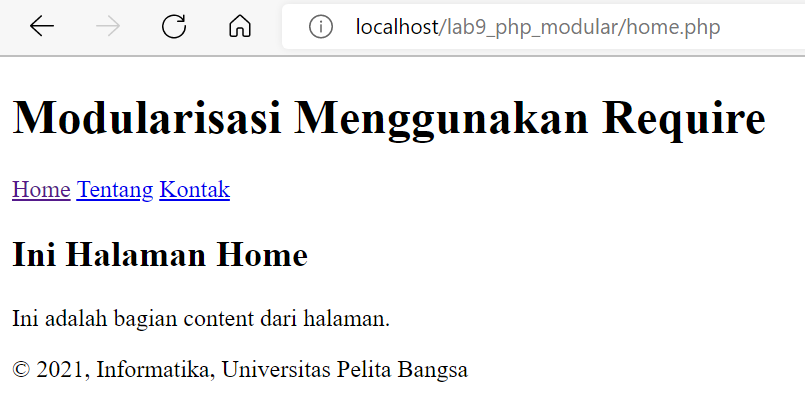
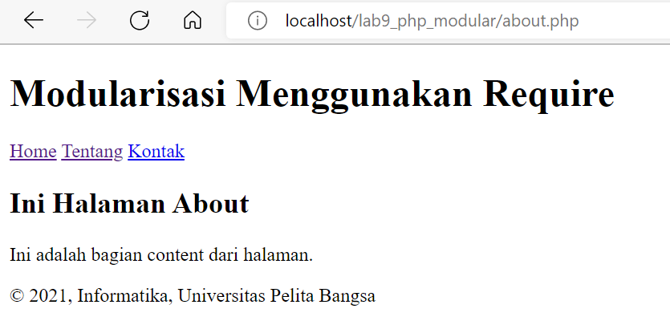
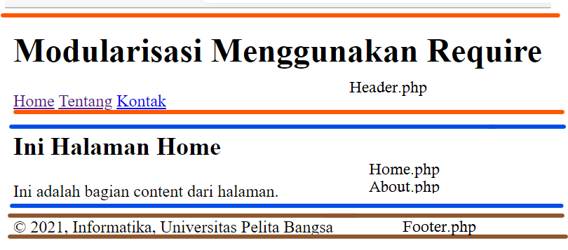

# Praktikum 9: PHP Modular

<strong>Repository ini dibuat untuk memenuhi tugas Pemrograman Web</strong>
| <strong>Nama</strong>      | <strong>Riris Naomi Gurning</strong>  |
| ----------- | ----------- |
| <strong>NIM</strong>     | <strong>312010190</strong>       |
| <strong>Kelas</strong>   | <strong>TI.20.A.1</strong>        |

# Langkah-langkah Praktikum 9 "PHP Modular"

## Sebelum memulai langkah - langkah sebaiknya kita mengaktifkan atau menyalakan MySQL di Aplikasi Xampp


# 1. <strong>Membuat file baru dengan nama header.php</strong>
## Masukkan kode dibawah ini:
````php
<!DOCTYPE html>
<html lang="en">
<head>
    <meta charset="UTF-8">
    <title>Contoh Modularisasi</title>
    <link href="style.css" rel="stylesheet" type="text/stylesheet"
media="screen" />
</head>
<body>
    <div class="container">
        <header>
            <h1>Modularisasi Menggunakan Require</h1>
        </header>
        <nav>
            <a href="home.php">Home</a>
            <a href="about.php">Tentang</a>
            <a href="kontak.php">Kontak</a>
        </nav>
````
## <strong>Posisi header.php biasanya ada di bagian atas atau awalan. Hasil format diatas sebagai berikut:</strong>


# 2. Membuat file baru dengan nama footer.php
## Masukkan kode dibawah ini:
```php
<footer>
            <p>&copy; 2021, Informatika, Universitas Pelita Bangsa</p>
        </footer>
    </div>
</body>
</html>
```
## <p><strong>Posisi footer.php biasanya ada di bagian akhir kalimat artikel.Hasil format diatas sebagai berikut:</strong></p>


# 3. Membuat file baru dengan nama home.php
## Masukkan kode dibawah ini:
```php
<?php require('header.php'); ?>
<div class="content">
    <h2>Ini Halaman Home</h2>
    <p>Ini adalah bagian content dari halaman.</p>
</div>
<?php require('footer.php'); ?>
```
## <p><strong>Posisi home.php biasanya ada di bagian akhir kalimat artikel.Hasil format diatas sebagai berikut:</strong></p>


# 4. Buat file baru dengan nama about.php
## Masukkan kode dibawah ini:
```php
<?php require('header.php'); ?>
<div class="content">
    <h2>Ini Halaman About</h2>
    <p>Ini adalah bagian content dari halaman.</p>
</div>
<?php require('footer.php'); ?>
```
## <p><strong>Posisi about.php biasanya ada di bagian akhir kalimat artikel.Hasil format diatas sebagai berikut:</strong></p>


# 5. Kesimpulan Langkah-langkah Praktikum 9 "PHP Modular"
## Bahwa header letaknya dibagian atas atau kepala artikel, footer dibagian akhir atau di kaki artikel dan home & about terletak dibagian tengah atau tubuhnya artikel atau isinya artikel.


# Pertanyaan dan Tugas
