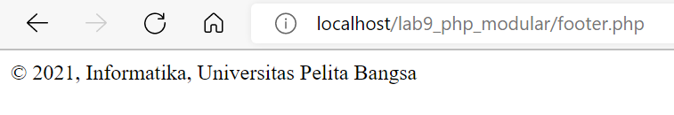

# Praktikum 9: PHP Modular

<strong>Repository ini dibuat untuk memenuhi tugas Pemrograman Web</strong>
| <strong>Nama</strong>      | <strong>Riris Naomi Gurning</strong>  |
| ----------- | ----------- |
| <strong>NIM</strong>     | <strong>312010190</strong>       |
| <strong>Kelas</strong>   | <strong>TI.20.A.1</strong>        |

# Langkah-langkah Praktikum 9 "PHP Modular"

# 1. <strong>Membuat file baru dengan nama header.php</strong>

````php
<!DOCTYPE html>
<html lang="en">
<head>
    <meta charset="UTF-8">
    <title>Contoh Modularisasi</title>
    <link href="style.css" rel="stylesheet" type="text/stylesheet"
media="screen" />
</head>
<body>
    <div class="container">
        <header>
            <h1>Modularisasi Menggunakan Require</h1>
        </header>
        <nav>
            <a href="home.php">Home</a>
            <a href="about.php">Tentang</a>
            <a href="kontak.php">Kontak</a>
        </nav>
````
<strong>Hasil format diatas sebagai berikut:</strong>


# 2. Membuat file baru dengan nama footer.php

```php
<footer>
            <p>&copy; 2021, Informatika, Universitas Pelita Bangsa</p>
        </footer>
    </div>
</body>
</html>
```
# 3. Membuat file baru dengan nama home.php
```php
<?php require('header.php'); ?>
<div class="content">
    <h2>Ini Halaman Home</h2>
    <p>Ini adalah bagian content dari halaman.</p>
</div>
<?php require('footer.php'); ?>
```
<strong>Hasil format diatas sebagai berikut:</strong>


# 4. Buat file baru dengan nama about.php

# 5. Membuat file baru dengan nama footer.php